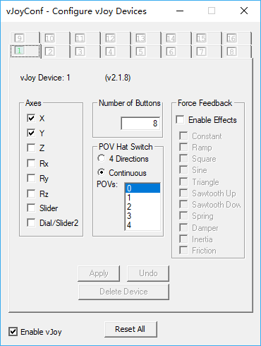

# 键盘游玩sdvx教程

原仓库地址: [sdvx-feeder-script](https://github.com/ars-magna/sdvx-feeder-script)

要使用键盘游玩sdvx，需要安装FreePIE跟vJoy这两个工具:

FreePIE: http://andersmalmgren.github.io/FreePIE/

vJoy: http://vjoystick.sourceforge.net/site/index.php/download-a-install/download

并且需要下载本仓库的[SDVX-KB.py](https://raw.githubusercontent.com/ars-magna/sdvx-feeder-script/master/SDVX-KB.py)脚本(点开链接后右键另存为)

如何使用?
1. 下载并安装好vJoy跟FreePIE，重启电脑。
2. 打开Configure vJoy(在开始菜单可以找到)，点开一个空的controller slot(也就是标有数字的，默认点开第一个)。
3. 取消`Axes`部分除了`X、Y`以外的勾选，取消`Enable Effects`的勾选，并且勾选上`Reset All`旁边的`Enable vJoy`,最后点击`Apply`。

4. 以**管理员身份**运行`FreePIE`，然后点`open`,选择你刚下好的`SDVX-KB.py`，打开。
5. 加载好`SDVX-KB.py`后，按`F5`或者点击`Script - Run Script`即可，下一次打开FreePIE可以在`File - Recent File`找到你打开过的`SDVX-KB.py`。
6. 打开SDVX的`config.bat`，在`Analog`那里，`Device`选择`vJoy - Virtual Joystick`即可(如果你设置的按键成功，在这里按对应按键会看到旋钮会动)。
注: SDVX-KB.py 可以修改键位参数以及旋钮灵敏度的参数，根据注释操作即可。[按键参数参考](https://docs.microsoft.com/en-us/dotnet/api/system.windows.forms.keys?view=netframework-4.7.2)，有部分按键没有。